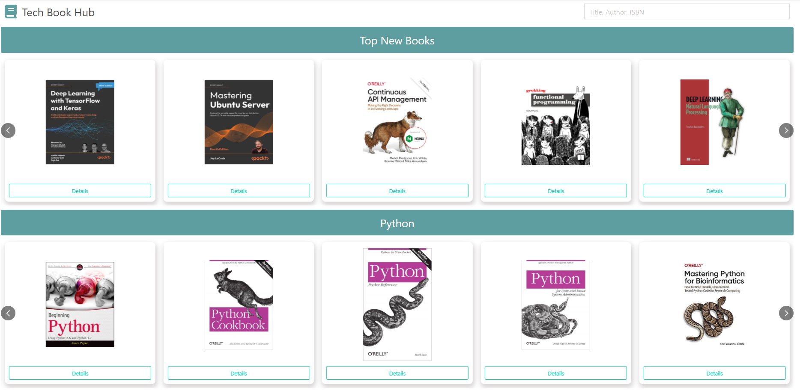

# Tech Book Hub
This application was created using HTML, CSS, Bulma, and React. Tech Book Hub uses the ([IT Bookstore API v1.0](https://api.itbook.store/)) to fetch book information. The application was created for React practice.  

- [Check it out here!](https://arcoschris.github.io/TechBookHub/)

## TODO:
### - Allow users to search by ISBN, Author, Title
### - Pop-up modal on image hover for larger view
### - Book description modal on detail button click
### - Work on styling

 

## Created by: 
### Christopher Arcos ([@ArcosChris](https://github.com/ArcosChris)) 
